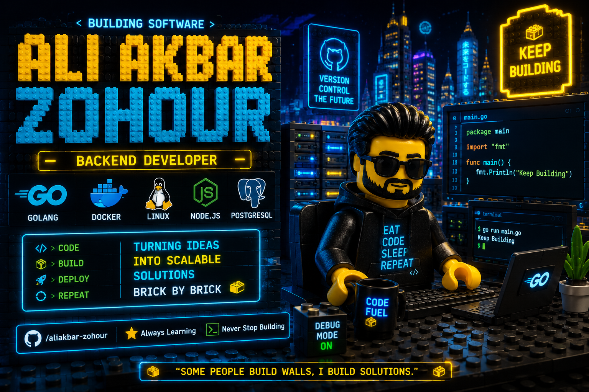

# 👋 Hi, I'm Ali Akbar Zohour

### Backend Engineer

Go • Docker • Linux

 

> 🧱 Building software brick by brick.

 

---

## About

I'm a backend developer who enjoys building scalable systems, clean APIs, and reliable infrastructure.

Currently focused on:

- ⚡ Golang
- 🐳 Docker
- 🐧 Linux
- 🗄 PostgreSQL
- 🚀 Microservices

---

---

### Always Learning. Always Building.

⭐ If you like my work, feel free to explore my repositories.

